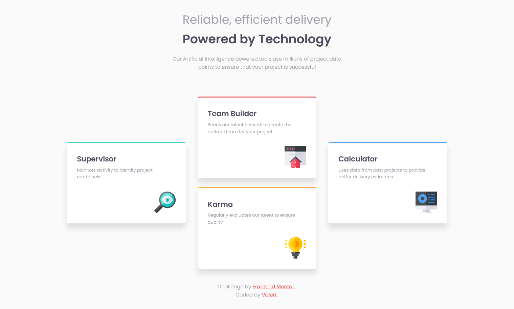

# Frontend Mentor - Four card feature section solution

This is a solution to the [Four card feature section challenge on Frontend Mentor](https://www.frontendmentor.io/challenges/four-card-feature-section-weK1eFYK). Frontend Mentor challenges help you improve your coding skills by building realistic projects.

## Table of contents

-   [Overview](#overview)
    -   [The challenge](#the-challenge)
    -   [Screenshot](#screenshot)
    -   [Links](#links)
-   [My process](#my-process)
    -   [Built with](#built-with)
    -   [Useful resources](#useful-resources)
-   [Author](#author)

## Overview

### The challenge

Users should be able to:

-   View the optimal layout for the site depending on their device's screen size

### Screenshot

### Mobile design

### Desktop design

### Links

-   Solution URL: [Add solution URL here](https://your-solution-url.com)
-   Live Site URL: [Add live site URL here](https://your-live-site-url.com)

## My process

### Built with

-   Semantic HTML5 markup
-   CSS custom properties
-   Flexbox
-   CSS Grid
-   Mobile-first workflow

### Useful resources

-   [browser-sync](https://www.npmjs.com/package/browser-sync) - npm package for live server.
-   [copyfiles](https://www.npmjs.com/package/copyfiles) - npm package. copy files easily.
-   [npm-run-all](https://www.npmjs.com/package/npm-run-all) - A CLI tool to run multiple npm-scripts in parallel or sequential.
-   [onchange](https://www.npmjs.com/package/onchange) - Use glob patterns to watch file sets and run a command when anything is added, changed or deleted.
-   [sass](https://www.npmjs.com/package/sass) - npm package is a distribution of Dart Sass. Sass makes CSS fun again.
-   [postcss](https://postcss.org/) - A tool for transforming CSS with JavaScript.
-   [postcss-cli](https://www.npmjs.com/package/postcss-cli) - Postcss from command line.
-   [autoprefixer](https://www.npmjs.com/package/autoprefixer) - PostCSS plugin to parse CSS and add vendor prefixes to CSS rules using values from Can I Use.
-   [group-css-media-queries](https://www.npmjs.com/package/group-css-media-queries) CSS postprocessing: group media queries.

## Author

-   Frontend Mentor - [@Valeri85](https://www.frontendmentor.io/profile/Valeri85)
-   Twitter - [@Valeri](https://www.twitter.com/Valeri79125128)
